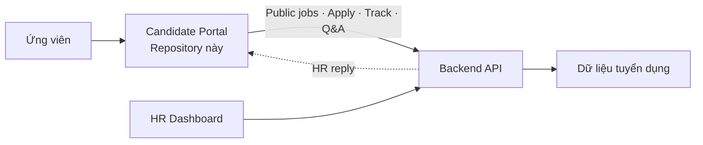
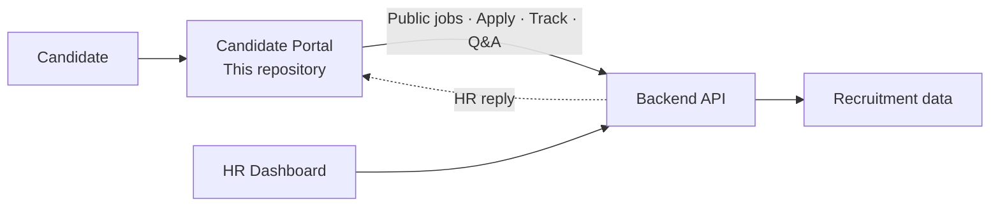

# VTT Careers HRM — Candidate Portal

> Hành trình ứng viên công khai từ tìm việc, nộp CV đến theo dõi hồ sơ và trao đổi với HR.<br>
> A public candidate journey from job discovery and CV application to status tracking and HR Q&A.

[Tiếng Việt](#tiếng-việt) · [English](#english) · [Live Demo](https://jobs.votrithuc.click) · [HR Dashboard](https://hrm.votrithuc.click) · [Yêu cầu demo & triển khai](https://github.com/trithucvo010704)

**Repositories:** [Backend API](https://github.com/trithucvo010704/DATN_backend) · [HR Dashboard](https://github.com/trithucvo010704/hrm_dashboard) · [Candidate Portal](https://github.com/trithucvo010704/candidate_portal)

## Tiếng Việt

### Vì sao cần Candidate Portal?

Ứng viên thường phải tìm việc, gửi CV và hỏi trạng thái qua nhiều kênh nhưng không có một nơi minh bạch để theo dõi. Candidate Portal cung cấp một hành trình công khai, thân thiện với mobile và kết nối trực tiếp với workspace của HR.

| Pain point | Giá trị Portal mang lại |
|---|---|
| Khó tìm đúng vị trí | Tìm kiếm theo từ khóa, địa điểm và hình thức làm việc |
| Thiếu thông tin trước khi ứng tuyển | Job Detail hiển thị JD, mức lương, địa điểm và các vòng tuyển |
| Nộp CV qua kênh rời rạc | Apply multipart gửi trực tiếp vào hệ thống tuyển dụng |
| Không biết hồ sơ đang ở đâu | Tracking bằng email và số điện thoại |
| Câu hỏi không đến đúng HR | Web Q&A đi vào Inbox và phản hồi HR hiển thị lại trên Portal |

### Tính năng chính

- Public job search, filter và Job Detail.
- Apply CV PDF/DOC/DOCX với validation được Việt hóa.
- Chống một ứng viên nộp trùng cùng một job.
- Theo dõi application và lịch sử vòng tuyển.
- Web Q&A, AI response và HR replies.
- Responsive, hỗ trợ keyboard và accessible UI.
- Mock mode rõ ràng cho demo offline; production dùng API thật.

### Vị trí trong hệ thống



Repository này là public client dành cho ứng viên. Portal chỉ dùng public contract cần thiết, không yêu cầu Dashboard JWT cho public flow và không chứa logic vận hành HR hoặc worker.

### Hành trình ứng viên

```text
Tìm vị trí phù hợp → Đọc JD và quy trình tuyển → Nộp CV
→ Đặt câu hỏi theo job → Theo dõi application và lịch sử vòng tuyển
```

### Trạng thái hiện tại

**Đã triển khai và kiểm chứng**

- Job search, work-time filter và Job Detail.
- Validation ứng tuyển tiếng Việt và duplicate application response.
- Application tracking và lịch sử vòng tuyển.
- Web Q&A và HR reply end-to-end.
- Responsive tại các breakpoint đã audit.
- Đã kiểm tra lint, typecheck và production build.

**Giới hạn**

- Chưa có checkout hoặc cổng thanh toán.
- Chat widget không đại diện cho một external support provider đã tích hợp hoàn chỉnh.
- Application mới thành công cần dữ liệu ứng viên chưa từng nộp job được chọn.

### Công nghệ

- Next.js 15.5, React 19, TypeScript 5.
- Tailwind CSS 4, Base UI, Lucide React.
- Public API service layer và accessible responsive UI.

### Chạy local

```powershell
npm install
$env:NEXT_PUBLIC_API_URL="http://localhost:8080"
$env:NEXT_PUBLIC_USE_MOCKS="false"
npm run dev -- --port 3002
```

```powershell
npm run lint
npm run build
```

Có thể bật mock offline bằng `NEXT_PUBLIC_USE_MOCKS=true`. Không dùng kết quả mock để kết luận backend integration đã đạt.

### Cấu trúc dự án

- `src/app/candidate`: public route dành cho ứng viên.
- `src/components/portal`: candidate-facing UI.
- `src/lib/services/public-job.service.ts`: ranh giới API thật/mock.
- `src/lib/public-types.ts`: public DTO types.

Public API behavior phải được đối chiếu tại [Backend API repository](https://github.com/trithucvo010704/DATN_backend).

### Demo và mua/triển khai

- [Live Candidate Portal](https://jobs.votrithuc.click)
- [HR Dashboard](https://hrm.votrithuc.click)
- [Yêu cầu demo, custom domain, mua quyền triển khai hoặc tích hợp thương mại](https://github.com/trithucvo010704)

Hiện chưa có checkout hoặc cổng thanh toán thật. Việc triển khai thương mại được trao đổi trực tiếp với maintainer.

### Bản quyền

Dự án chưa công bố public license. Hãy liên hệ maintainer trước khi tái sử dụng, phân phối hoặc triển khai thương mại.

---

## English

### Why this portal?

Candidates often discover jobs, submit CVs, and request updates through separate channels with no transparent place to follow progress. Candidate Portal provides a public, mobile-friendly journey connected directly to the HR workspace.

| Pain point | Portal value |
|---|---|
| Relevant jobs are hard to discover | Search by keyword, location, and work arrangement |
| Important details are missing before applying | Job Detail exposes the JD, salary, location, and hiring rounds |
| CV intake happens through disconnected channels | Multipart applications flow directly into the recruitment system |
| Candidates cannot see progress | Track applications with email and phone |
| Questions do not reach the right recruiter | Web Q&A enters the Inbox and HR replies return to the portal |

### Key capabilities

- Public job search, filters, and job details.
- PDF/DOC/DOCX application with localized validation.
- Duplicate application protection per candidate and job.
- Application tracking and round history.
- Web Q&A, AI responses, and visible HR replies.
- Responsive, keyboard-friendly, and accessible UI.
- Explicit mock mode for offline demos; production uses the real API.

### System role



This repository is the public candidate client. It consumes only the required public contracts, does not require the Dashboard JWT for public flows, and does not contain HR or worker operations.

### Candidate workflow

```text
Discover a job → Review the JD and hiring rounds → Submit a CV
→ Ask a job-specific question → Track the application and round history
```

### Current status

**Implemented and verified**

- Job search, work-time filtering, and Job Detail.
- Localized application validation and duplicate application response.
- Application tracking and round history.
- Web Q&A and end-to-end HR reply visibility.
- Responsive behavior across the audited breakpoints.
- Lint, typecheck, and production build verification.

**Limitations**

- There is no checkout or payment flow.
- The chat widget does not represent a fully integrated external support provider.
- A successful new application requires candidate data that has not already applied to the selected job.

### Technology

- Next.js 15.5, React 19, TypeScript 5.
- Tailwind CSS 4, Base UI, Lucide React.
- Public API service layer and accessible responsive UI.

### Local development

```powershell
npm install
$env:NEXT_PUBLIC_API_URL="http://localhost:8080"
$env:NEXT_PUBLIC_USE_MOCKS="false"
npm run dev -- --port 3002
```

```powershell
npm run lint
npm run build
```

Offline mocks can be enabled with `NEXT_PUBLIC_USE_MOCKS=true`. Mock output must not be treated as proof of backend integration.

### Project structure

- `src/app/candidate`: public candidate routes.
- `src/components/portal`: candidate-facing UI.
- `src/lib/services/public-job.service.ts`: real API/mock boundary.
- `src/lib/public-types.ts`: public DTO types.

Public API behavior must be checked against the [Backend API repository](https://github.com/trithucvo010704/DATN_backend).

### Demo and commercial deployment

- [Live Candidate Portal](https://jobs.votrithuc.click)
- [HR Dashboard](https://hrm.votrithuc.click)
- [Request a product demo, custom domain, product licensing, or commercial deployment](https://github.com/trithucvo010704)

There is no real checkout or payment flow yet. Commercial deployment is arranged directly with the maintainer.

### License

No public license has been declared. Contact the maintainer before reuse, redistribution, or commercial deployment.
